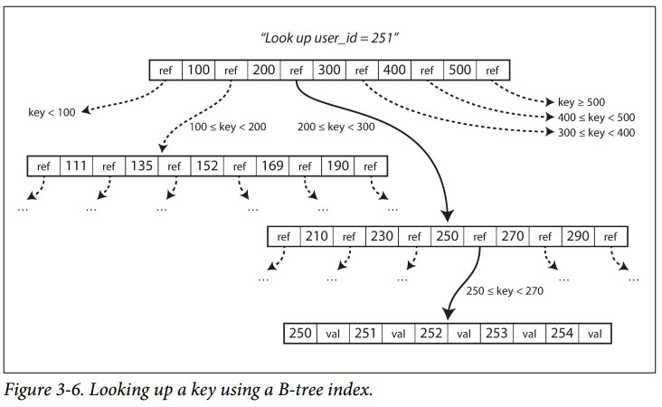
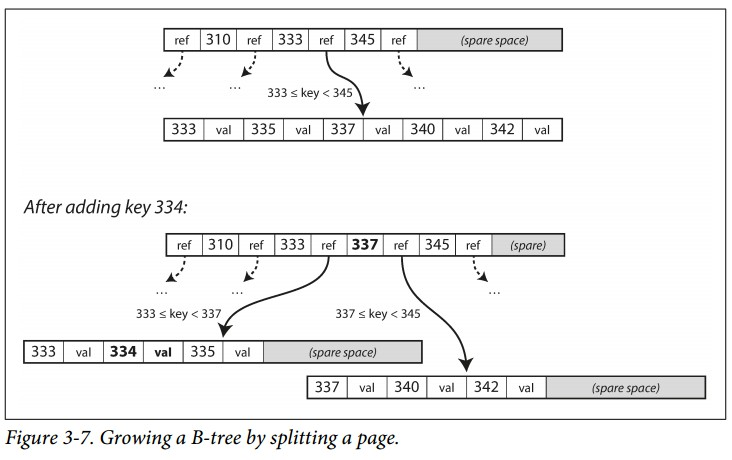

### B树索引
B树索引是关系型数据库的标准索引结构，许多非关系型数据库也使用它  
log-structured索引是将数据放到不定长度的segment文件中，并且采用顺序写。**B树将数据放到定长的block或page中(常用4KB)，而且每次读写一页。这种设计与底层的硬件相对应，磁盘通常是按照定长block组织的**。
  

  
插入新数据，分裂原有叶子节点

n个节点的B树深度为O(log n)，大部分数据库深度为3, 4层

#### 使B树更可靠
B树的写入会使用新的数据覆盖磁盘上已有的数据，这与LSM-tree不一样，LSM-tree总是append到文件末尾，从不就地修改文件  
一些写入操作需要写入多页(上面提到B树会按页写入磁盘)，如果在写入过程中数据库崩溃，会导致数据不正确，为了防止崩溃后无法恢复，B树索引通常会包含一个log (write-ahead log, WAL, 也叫 redo log)。这是一个只能追加的文件，每次B树的修改都必须先追加到这个文件，当崩溃发生后，它被用来做数据恢复  
B树的原地修改机制会使得多个线程同时访问B树时并发控制比较复杂，通过使用latch (轻量级锁) 来做并发保护，相比之下，log-structured的方式就更容易一些

#### 优化B树
B树的优化点：
- 不使用原地回写和WAL，使用copy-on-write机制，在写入时写到不同的位置，创建数据的新版本，然后将索引指向这个新的地方。这种方式在做并发控制时同样很有用
- 不存储完整的key，而是存放key的简写，减小key占据的存储空间，提高每页包含的key的数量
- 将key范围中相邻的key对应的数据页按照顺序存放
- 使用额外的指针连接叶子结点，从而可以按照顺序扫描key，而不用跳回到父节点 (B+树)
- B树的变种例如fractal tree借鉴了log-structured的一些思想来减少磁盘查找