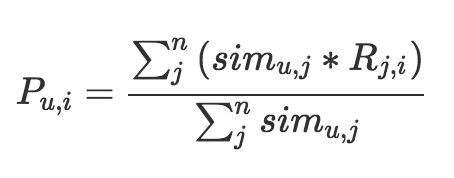

## 协同过滤
1. 基于记忆的协同过滤(Memory-Based)
2. 基于模型的协同过滤(Model-Based)

## 基于用户的协同过滤
原理: 根据人的兴趣口味将用户进行聚类，给相似的用户推荐相同的商品。**关键在于量化相似人群**  
核心数据: **用户物品关系矩阵**  

### 第一步: 准备用户向量，理论上每个用户在矩阵中都有一个向量
用户向量的特点:  
1. 向量的维度是物品的个数
2. 向量是稀疏的，因为用户只会消费一小部分物品
3. 向量维度上的取值可以是简单的布尔值，表明用户是否喜欢物品

### 第二步: 用每个用户的向量，两两计算用户之间的相似度。
设定相似度阈值或设定一个最大数量，为每个用户保留最相似的 K 个用户

### 第三步: 为每个用户产生推荐结果
把相似用户喜欢过的物品汇总，去掉用户自己已经消费的，剩下的排序输出产生推荐结果

公式左边是用户u和物品i的匹配分数，右边分母把和用户u相似的n个用户的相似度相加，分子把这n个用户各自对物品i的态度按照相似度加权求和

## 实践
### 如何构造矩阵
根据用户行为日志构造稀疏矩阵，使用CSR 或 COO 等稀疏矩阵的存储格式

### 相似度计算
单个向量太长，维度太多，如何计算：
1. 向量采样：从总体1000维向量中随机抽取100维计算相似度。这个算法叫DIMSUM，由Twitter提出。
2. 向量化计算：利用GPU，多媒体指令计算

用户量很大，两两计算代价很大:
1. 拆分成MapReduce任务，键为用户对，值为两个用户对同一个物品的评分之积，Reduce阶段再对这些乘积求和，MapReduce结束后对这些值归一化
2. 不基于用户做协同过滤

计算对象两两相似度任务，如果数据量不大，并且矩阵稀疏，可以使用KGraph或GraphCHI等

### 推荐计算
我们并不需要计算用户和每个物品的得分，只用计算相似用户喜欢过的物品。将任务拆分成MapReduce计算上面的第三步

## 改进
1. 惩罚热门物品的喜欢程度，热门物品并不代表用户的真实兴趣
2. 喜欢程度随时间衰减，使用指数函数，指数为一个负值，距现在时间间隔越大，喜欢程度越小
