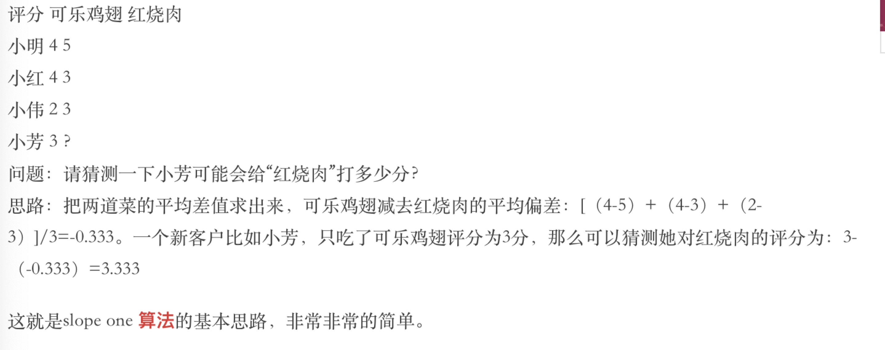

## 背景
### 基于用户协同过滤的问题:
1. 用户数量大，计算起来很吃力
2. 用户口味变化快，兴趣迁移比较难反应出来
3. 数据稀疏，用户与用户之间共同的消费行为实际上是很少的，大多集中在热门商品，对发现用户兴趣帮助不大

## 基于物品的协同过滤
基于物品的协同过滤首先计算相似物品，然后根据用户消费过，或者正在消费的物品为其推荐相似的物品  
1. 物品数量远小于用户数量
2. 物品之间相似度比较静态，变化不大
3. 物品对应的消费者数量较大，对于计算物品之间的相似度稀疏度是好过计算用户之间相似度的。

### 基本步骤
1. 构建用户物品关系矩阵，矩阵元素可以是用户消费，评价，点赞，收藏等行为
2. 如果矩阵行表示物品，列表示用户，那么行向量相乘得到物品相似度
3. 应用场景：相关物品推荐；个人首页产生“猜你喜欢”推荐结果

### 计算物品相似度
物品向量：
1. 稀疏向量，维度是用户
2. 各维度取值是用户对物品的消费结果，可以是使用次数，消费时长，也可以是评分

改进方式:
1. 物品中心化: 矩阵中的分数，减去物品分数的均值，这是为了去掉物品中铁杆粉丝的非理性因素，比如用户都给物品打高分(类似于Bias-SVD中的物品偏置)
2. 用户中性化: 矩阵中的分数，减去对应用户分数的均值，去掉不同人打分标准的不同(类似于Bias-SVD中的用户偏置)

### 计算推荐结果
预测用户u对物品i的分数:
1. 遍历用户u评分过的所有物品，假设m个，每个物品和物品i的相似度乘以用户评分，然后求和(加权求和)
2. 加权求和总分除以所有相似度总和，得到用户u对物品i的分数预测
选择用户u的TOPK个高分物品，实现“猜你喜欢”

### Slope One 算法
经典的基于物品的推荐问题:
1. 计算过程离线，相似度矩阵无法实时更新
2. 相似度计算没有考虑置信度，例如有两个物品，都被同一个用户喜欢，且只被这个用户喜欢，那么余弦相似度计算的结果是1，这个1在最后汇总计算推荐分数时，对结果的影响最大。

Slope One算法对这些问题有很好的改进，它专门针对评分矩阵，不适用于行为矩阵

Slope One 优缺点:
1. 简单，易于实现，执行效率高
2. 存在冷启动和稀疏性问题

